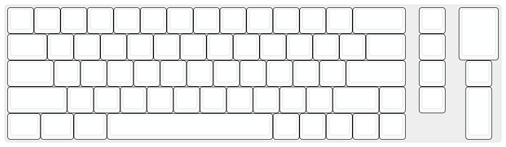
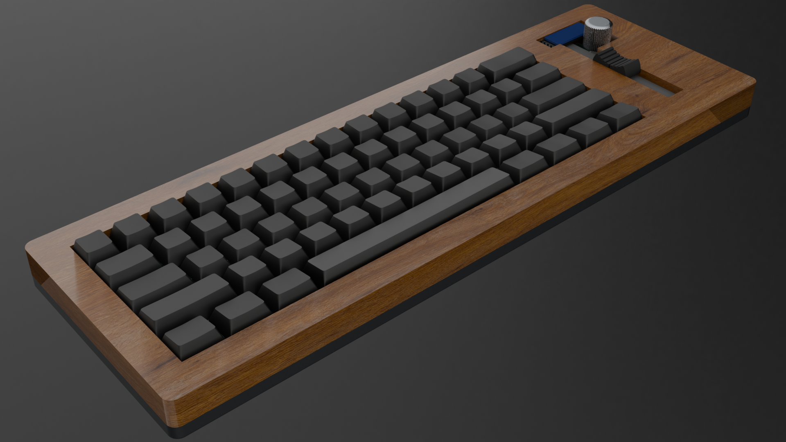

# Gallery

## 2026-07-09

*SVG layout showing the initial key positioning.*

*Schematic and PCB design progress from 9 July.*

## 2026-07-10

*PCB routing and case design work from 10 July.*

## 2026-07-12

*Routing and layout refinements from 12 July.*

## 2026-07-15

*Blender screenshots from 15 July.*

## 2026-07-16

*PCB front and back (with silkscreen) from 16 July.*

*Full concept render of the keyboard case and PCB.*
