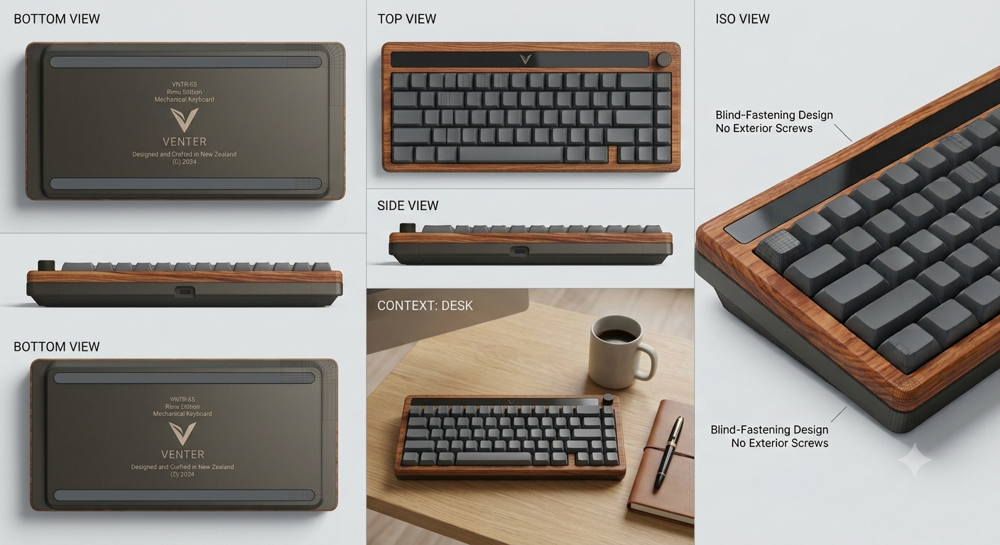

# **VNTR-65**
A custom, over-engineered 65% keyboard featuring an RP2350 MCU, a hall effect key matrix, an analog slide potentiometer, an OLED display. Built for daily use thanks to HackClub.
## Onshape Link
Onshape link for the [Case](https://cad.onshape.com/documents/299d1cd18e1c0fa7ad37c188/w/39af968ec4536d8e3dda6814/e/b83c5326b9acf81a68bd5a35?renderMode=0&uiState=6a509a3fdb7545b8e7caa558).

## **Temporary** AI Concept Image

**Note: This is temporary I will make a concept render in blender I just don't have access to a computer atm and just wanted to get my vision through and it exicuted decently well to what I had in my head.**
